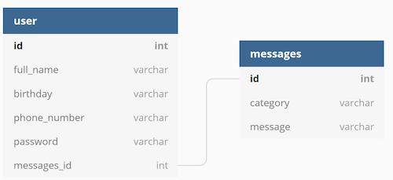
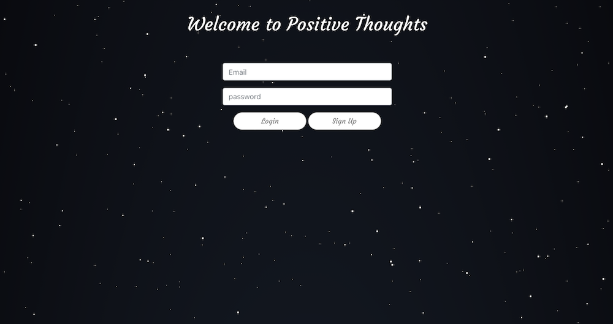
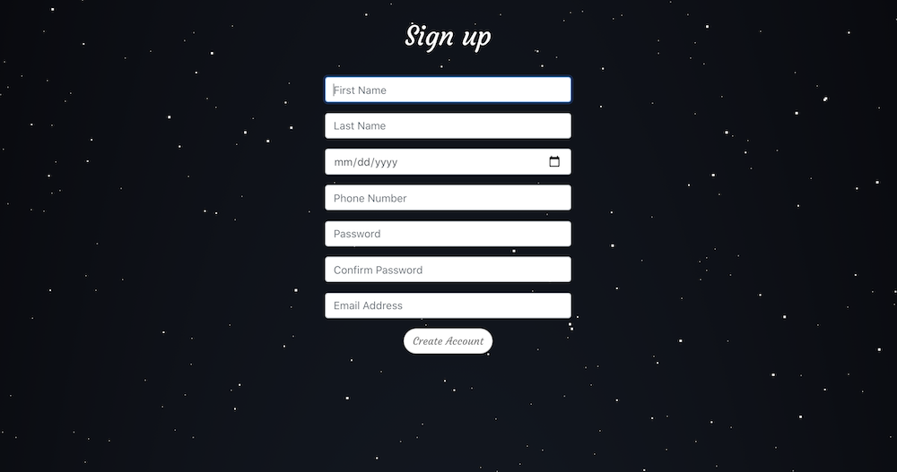
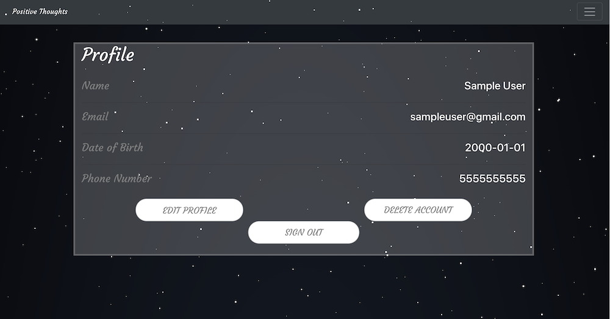
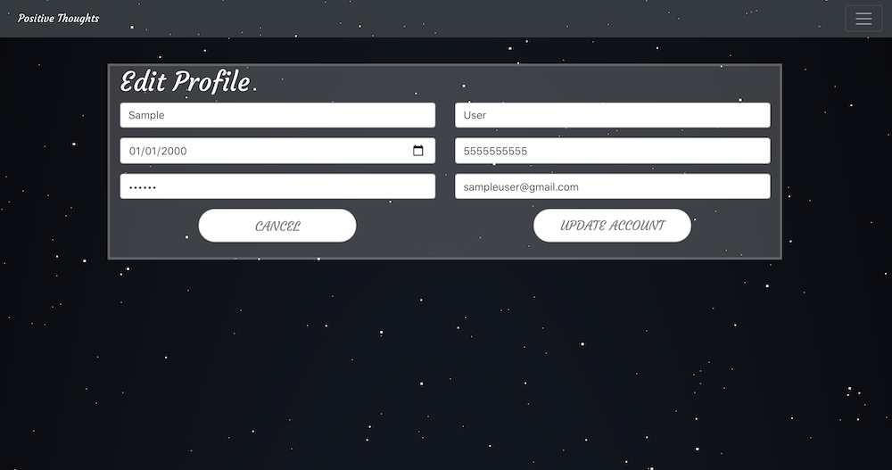
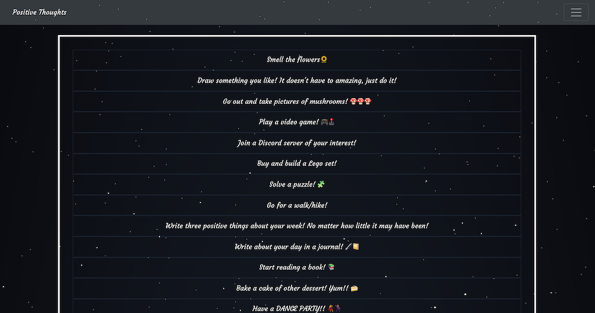
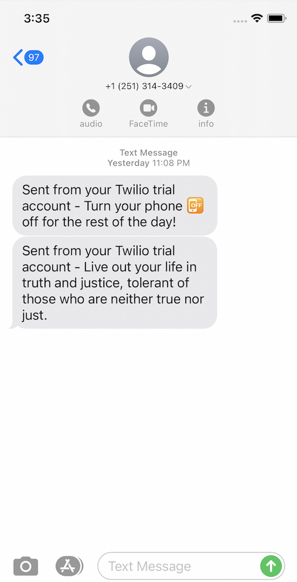

# Positive-Thoughts

## Table of Contents
#### &nbsp;&nbsp;&nbsp;&nbsp;[1)&nbsp;Introduction](#introduction)
#### &nbsp;&nbsp;&nbsp;&nbsp;[2)&nbsp;Description](#description)
#### &nbsp;&nbsp;&nbsp;&nbsp;[3)&nbsp;Features](#features)
#### &nbsp;&nbsp;&nbsp;&nbsp;[4)&nbsp;Usage](#usage)
#### &nbsp;&nbsp;&nbsp;&nbsp;[5)&nbsp;Contributing](#contributing)
#### &nbsp;&nbsp;&nbsp;&nbsp;[6)&nbsp;License](#license)
#### &nbsp;&nbsp;&nbsp;&nbsp;[7)&nbsp;Questions](#questions)   

## Introduction 

This "Project-3" of the Georgia Tech Full Stack Flex Full-time Coding program was an opportunity to work with our peers to "pull everything together" that we have learned through the cohort.  We were instructed to build a full-stack MERN application utilizing MongoDB, Express, React, and NodeJS, the four technologies that make up the stack.  This was to be accomplished while having a polished front-end/UI, a folder structure meeting the MVC paradigm, and incorporating good quality coding standards.  Additional requirements included:
    1)  Having both GET and POST routes for retrieving and adding new data.
    2)  Deploying to Heroku with data.
    3)  Utilizing at least 2 new libraries, packages, or technologies that we haven't discussed in class. 
    4)  Authenticating users in some way.

The app also had to be responsive.

## Description

The concept/idea for this project came from group member Andrew Marcus and the inspiration for it was his interest in helping the many people that suffer from anxiety and depression.  Fellow group member Jamie Jones shares this passion so it was a natural fit for our project subject.

Positive Thoughts is a mental health companion app that is intended to improve one’s outlook with the power of positive thinking.  2020 has been a rough year to say the least and according to the American Psychological Association (https://www.apa.org/news/press/releases/2020/10/stress-mental-health-crisis), this has led to a mental health crisis.  We think a mental health site is an effective means of helping people. Rick Nauert PhD agrees with us and a study backing up this hypothesis was conducted by Brigham Young University. (https://psychcentral.com/news/2017/11/21/mobile-apps-can-help-manage-and-support-mental-emotional-health/129055.html ) Also, the Anxiety and Depression Association of America is actively looking for mobile-apps that can help people that are struggling (https://adaa.org/finding-help/mobile-apps).  The times in which we live mean that we need to combat anxiety now more than ever.

You don't really need any organizations though to back up our premise because in our opinion it is obvious.  The primary function of the Positive Thoughts is to automatically send positive and inspirational messages to the user via text message in order to give them a little bit of a lift when they might need one.

Our user story is as follows:

--AS A: person who is doing my best to get through these very trying times
--I WANT: an app that acts as a digital cheerleader bringing me uplifting notifications throughout the day
--SO THAT: I can keep Positive Thoughts going and keep persevering as best I can.

One aspect of this project that makes it stand out is the use of a scrolling, "starry night" background.  Just opening the app will at the very least have some calming effect on a user's current outlook.  This background was carefully chosen and was difficult to install because just a couple of weeks before installing the code had been updated.  However the updated code had bugs which required an installation of a previous version instead.

## Features

Besides the starry night background, this website application uses Twilio and Cron to send a user various messages via text.  These were both new libraries/technologies and neither concept was discussed during our class, it was like being stuck between Scylla and Charybdis.  The messages currently are in one category and are randomly chosen.  They can all be viewed together on the app's "Prompts" page.  

Through the use of another new library, JSONwebtoken, we authenticate users and prevent those who are logged in from being able to view the login or signup pages.  Users that are not logged in cannot view certain pages such as Profile and Prompts.

Our app also includes a Hotlines page which has a list of mental health hotlines and websites just in case the user needs them.

Positive-Thoughts uses a MongoDB called "positive-thoughts" with two collections, Users and Messages.

## Usage

The URL for this application is http://www.positive-thoughts.org.

The Heroku link for this application is https://positive-thoughts-gt.herokuapp.com/profile.

To run this app the repo first must be cloned at Github on this link:  https://github.com/Andrew0502/Positive-Thoughts

Once cloned a user needs to run npm init -y and then run NPM install.
 
 
Home Page

 
 
To create an account, a user goes to the URL and clicks the Sign Up button.  
 
 
Sign up Page

 
 
All fields on this form must be filled out, otherwise the user is alerted to a missing field and returned back to the form.  Passwords must match otherwise the user gets another alert.
 
 
Profile Page

 
 
Once a user has created an account they are taken to their profile page.  From here a user can update their profile information, sign out, or delete their account.  If they click on the Delete Account button they are presented with a Confirm to make sure this is what they want to do.
 
 
Edit Page

 
 
On the Edit page, a user can update any of the fields and click on Update Account, their account will then be updated.  A user can also click on Cancel and be returned back to the profile page.
 
 
Prompts

 
 
Hotlines

 
 
Sample Texts
 

## Contributing

Positive Thoughts Collaborators:

Andrew Marcus:  https://github.com/Andrew0502
 
Vincent Kendrick:  https://github.com/dagreatcode
 
Jamie Jones: https://github.com/jamjon94
 
Jeff Flynn: https://github.com/7J647
 
 

With special thanks to TA Peter Colella without who's help we would not have been able to accomplish this project.  Thanks also to TA Leif Hetland for his assistance and to TA Christina Starr for her help as well.  Though we didn't work with TA Philip Simmons we want to thank him for all of his help throughout the cohort and thank you to Instructor Jonathan Watson for all of his efforts these last few months.  

## License

---

Permission is hereby granted, free of charge, to any person obtaining a copy
of this software and associated documentation files (the "Software"), to deal
in the Software without restriction, including without limitation the rights
to use, copy, modify, merge, publish, distribute, sublicense, and/or sell
copies of the Software, and to permit persons to whom the Software is
furnished to do so, subject to the following conditions:

The below copyright notice and this permission notice shall be included in all
copies or substantial portions of the Software.

THE SOFTWARE IS PROVIDED "AS IS", WITHOUT WARRANTY OF ANY KIND, EXPRESS OR
IMPLIED, INCLUDING BUT NOT LIMITED TO THE WARRANTIES OF MERCHANTABILITY,
FITNESS FOR A PARTICULAR PURPOSE AND NONINFRINGEMENT. IN NO EVENT SHALL THE
AUTHORS OR COPYRIGHT HOLDERS BE LIABLE FOR ANY CLAIM, DAMAGES OR OTHER
LIABILITY, WHETHER IN AN ACTION OF CONTRACT, TORT OR OTHERWISE, ARISING FROM,
OUT OF OR IN CONNECTION WITH THE SOFTWARE OR THE USE OR OTHER DEALINGS IN THE
SOFTWARE.

---

## Questions

For questions or for other developers who would like to provide feedback on how to improve the work done on this project or offer other suggestions, please feel free to do so via the GitHub repositories provided.

&copy; 2020  Andrew Marcus, Vincent Kendrick, Jamie Jones, and Jeff Flynn